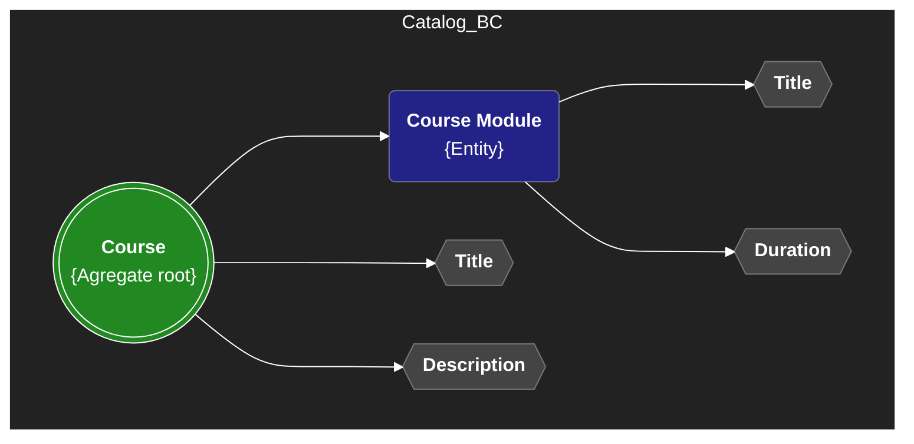
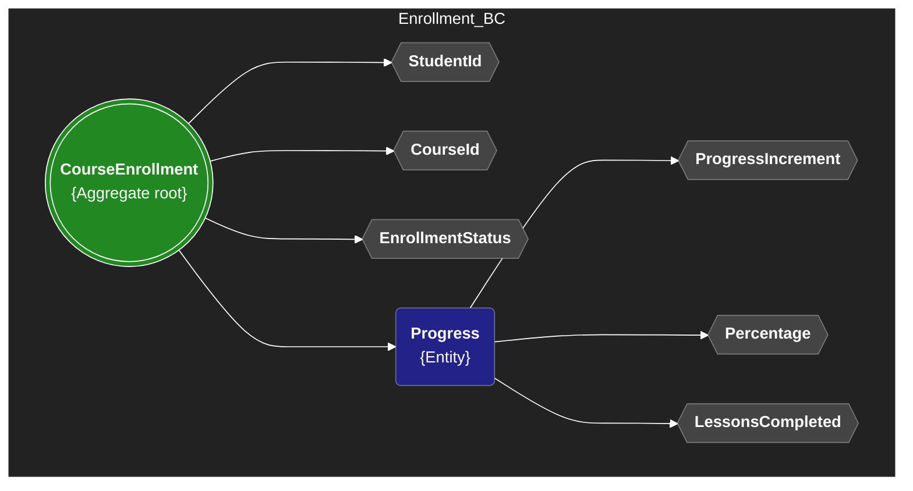
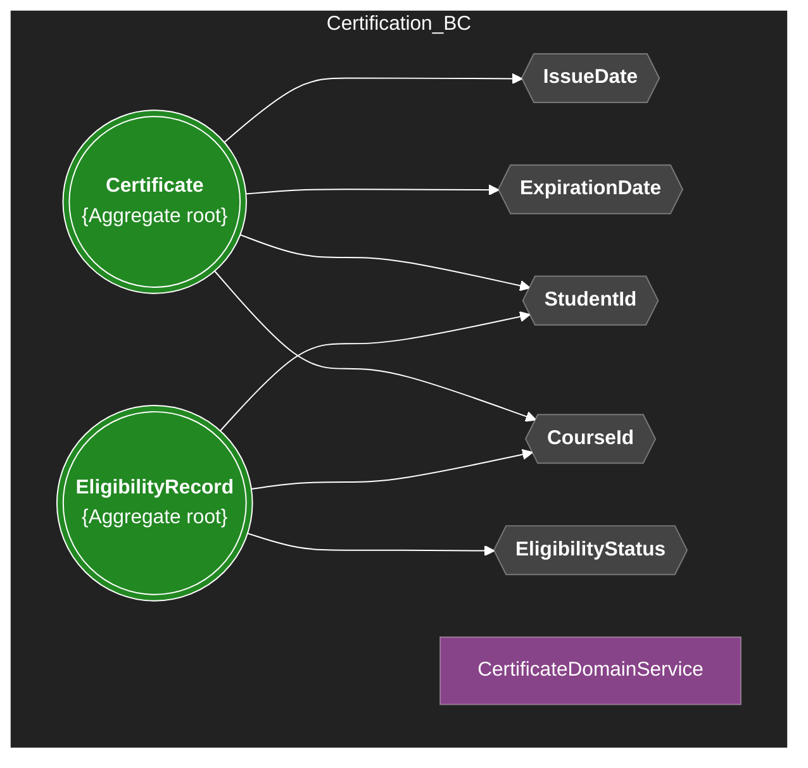
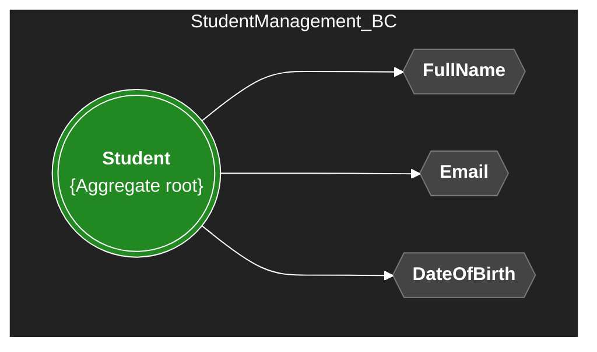

# Domain Layer Overview

This document describes the main bounded contexts, aggregate roots, value objects, domain events, and key business rules for the domain.

---

## Why Use Immutable Records for Value Objects?

In this project, all Value Objects are implemented as immutable C# records. This design choice brings several advantages for Domain-Driven Design:

- **Immutability:** Once created, a value object cannot be changed. This guarantees that its state remains consistent throughout its lifetime, preventing accidental or unintended modifications.
- **Value Equality:** Records in C# automatically implement value-based equality. Two value objects with the same data are considered equal, which is the expected behavior for value objects in DDD.
- **Thread Safety:** Immutable objects are inherently thread-safe, as their state cannot change after construction.
- **Conciseness:** Records reduce boilerplate code, as you do not need to manually override `Equals` and `GetHashCode`.
- **Expressiveness:** Immutability and value equality clearly communicate the intent and role of value objects in the domain model.

> **Note:** When using records with EF Core, always provide a parameterless constructor (public or protected) to ensure compatibility with the ORM.

---

## Bounded Contexts & Aggregate Roots

### Catalog BC

- **Aggregate Root:** `Course`
  - **Description:** Represents a course offered in the academy. Entry point for managing modules, title, and description.
  - **Entities:** `CourseModule`
  - **Value Objects:** `CourseTitle`, `CourseDescription`, `ModuleTitle`, `Duration`
  - **Domain Events:** `CourseCreated`, `CoursePublished`, `ModuleAddedToCourse`
  - **Validations:**
    - Course title and description must not be empty.
    - Modules must have a valid title and positive duration.
    - No duplicate modules per course.



### Enrollment BC

- **Aggregate Root:** `CourseEnrollment`
  - **Description:** Tracks a student's enrollment and progress in a course with flexible, configurable progression strategies.
  - **Entities:** `Progress`
  - **Value Objects:** `StudentId`, `CourseId`, `EnrollmentStatus`, `ProgressIncrement`, `CompletionPercentage`
  - **Domain Events:** `StudentEnrolled`, `LessonCompleted`, `CourseCompleted`, `EnrollmentSuspended`, `EnrollmentDropped`
  - **Progression Strategies:**
    - **Standard:** 10% per lesson (10 lessons to complete)
    - **Fast Track:** 5% per lesson (20 lessons to complete)
    - **Slow Track:** 20% per lesson (5 lessons to complete)
    - **Custom:** Any percentage between 1-100% per lesson
  - **Validations:**
    - A student can only be enrolled once per course (unique constraint on StudentId + CourseId).
    - Progress percentage must be between 0 and 100.
    - Progress increment must be between 1 and 100.
    - Enrollment status transitions must follow the valid lifecycle: ENROLLED → ACTIVE → COMPLETED (or SUSPENDED/DROPPED).
    - Progress can only be updated for active enrollments.
    - Lessons completed must match the required lessons based on progress increment strategy.



### Certification BC

- **Aggregate Root:** `Certificate`
  - **Description:** Represents a certificate issued to a student upon course completion.
  - **Value Objects:** `StudentId`, `CourseId`, `IssueDate`, `ExpirationDate`
  - **Domain Events:** `CertificateIssued`
  - **Domain Services:** `CertificateEligibilityService` (validates if a student is eligible for certification)
  - **Validations:**
    - Certificate can only be issued if the course is completed.
    - Expiration date must be after the issue date.
    - Each student can have only one certificate per course.

- **Aggregate Root:** `EligibilityRecord`
  - **Description:** Tracks a student's eligibility status for certificate issuance. Created when a student enrolls in a course, transitions through eligibility states, and can be revoked.
  - **Value Objects:** `StudentId`, `CourseId`, `EligibilityStatus`
  - **Domain Events:** `StudentBecameEligible`, `EligibilityRevoked`
  - **Eligibility States:**
    - **Pending:** Initial state when StudentEnrolled event is received
    - **Eligible:** Transitioned when CourseCompleted event is received (valid for 6 months)
    - **Ineligible:** Assigned when validation rules fail (e.g., duplicate certificate found)
    - **Revoked:** Set when eligibility is revoked due to compliance or other reasons
  - **Validations:**
    - StudentId and CourseId must not be null
    - Only Pending records can become Eligible or Ineligible
    - Only Eligible or Ineligible records can be Revoked
    - Eligibility expires 6 months after completion
    - Reason is required to mark as Ineligible or Revoke
  - **Key Methods:**
    - `CreateFromEnrollment(StudentId, CourseId)` - Factory method with Result<T> for validation handling
    - `MarkAsEligible()` - Transitions from Pending to Eligible, emits StudentBecameEligible event
    - `MarkAsIneligible(reason)` - Transitions from Pending to Ineligible
    - `Revoke(reason)` - Transitions to Revoked, emits EligibilityRevoked event
    - `IsValid` - Checks if eligible and not expired
    - `IsExpired` - Returns true if more than 6 months have passed since completion
    - `GetRemainingDays()` - Returns days until expiration



### Student Management BC

- **Aggregate Root:** `Student`
  - **Description:** Manages student information, lifecycle, and status. Entry point for personal data and enrollment eligibility.
  - **Value Objects:** `FullName`, `Email`, `DateOfBirth`
  - **Domain Events:** `StudentRegistered`, `StudentUpdated`, `StudentActivated`, `StudentSuspended`, `StudentDeleted`
  - **Validations:**
    - Email must be unique and valid.
    - Student must be in "Active" status to enroll in courses.
    - Cannot delete a student with active enrollments.



---

Each bounded context is independent and encapsulates its own rules, invariants, and business logic. Aggregate roots enforce consistency and invariants within their boundaries. Domain events are used to signal important state changes, and value objects ensure immutability and validation of key attributes. This approach promotes a clean, maintainable, and scalable domain model.

---

## Persistence & Implementation Details

### Database Schema

The domain model is persisted using **Entity Framework Core 8.0** with **PostgreSQL** as the primary database.

#### CourseEnrollments Table

| Column                   | Type      | Constraints | Purpose                                                             |
| ------------------------ | --------- | ----------- | ------------------------------------------------------------------- |
| `Id`                     | UUID      | PRIMARY KEY | Unique enrollment identifier                                        |
| `StudentId`              | UUID      | NOT NULL    | Reference to enrolled student                                       |
| `CourseId`               | UUID      | NOT NULL    | Reference to enrolled course                                        |
| `Status`                 | TEXT      | NOT NULL    | Enrollment status (ENROLLED, ACTIVE, COMPLETED, SUSPENDED, DROPPED) |
| `ProgressPercentage`     | INTEGER   | NOT NULL    | Current completion percentage (0-100)                               |
| `ProgressIncrementValue` | INTEGER   | NOT NULL    | Lessons per increment strategy (1-100)                              |
| `LessonsCompleted`       | INTEGER   | NOT NULL    | Number of lessons completed                                         |
| `ProgressId`             | UUID      | NOT NULL    | Reference to owned Progress entity                                  |
| `EnrolledOn`             | TIMESTAMP | NOT NULL    | Enrollment creation timestamp                                       |
| `ActivatedOn`            | TIMESTAMP | NULLABLE    | When enrollment became active                                       |
| `CompletedOn`            | TIMESTAMP | NULLABLE    | When course was completed                                           |
| `SuspendedOn`            | TIMESTAMP | NULLABLE    | When enrollment was suspended                                       |
| `DroppedOn`              | TIMESTAMP | NULLABLE    | When student dropped the course                                     |

**Indexes:**

- `IX_CourseEnrollments_StudentId` - Retrieve enrollments by student
- `IX_CourseEnrollments_CourseId` - Retrieve enrollments by course
- `IX_CourseEnrollments_StudentId_CourseId` (UNIQUE) - Enforce one enrollment per student per course

### Repository Pattern

The `IEnrollmentRepository` interface provides the following query methods:

- `GetByIdAsync(Guid id)` - Retrieve enrollment by ID
- `GetByStudentAndCourseAsync(Guid studentId, Guid courseId)` - Retrieve unique enrollment
- `GetByStudentAsync(Guid studentId)` - Retrieve all enrollments for a student
- `GetByCourseAsync(Guid courseId)` - Retrieve all enrollments in a course
- `GetActiveEnrollmentsAsync()` - Retrieve enrollments in ENROLLED, ACTIVE, or SUSPENDED states
- `GetCompletedEnrollmentsAsync()` - Retrieve completed enrollments
- `GetByProgressRangeAsync(int minPercentage, int maxPercentage)` - Filter by progress range
- `GetByProgressIncrementAsync(int incrementPercentage)` - Filter by progression strategy

### Testing Coverage

Comprehensive test coverage ensures domain integrity:

- **ProgressIncrementTests** (21 tests)
  - Factory methods validation (Standard, Fast, Slow, Custom)
  - Value range validation (1-100)
  - Lesson calculation accuracy

- **CourseEnrollmentWithProgressIncrementTests** (20 tests)
  - Enrollment lifecycle state transitions
  - Progress tracking with different strategies
  - Suspension and resumption logic
  - Domain event emissions

**Total Test Coverage:** 299 unit tests (258 original + 41 new)

### Configuration

Entity Framework Core uses fluent API configuration for:

- Owned entity mapping (Progress with nested ProgressIncrement)
- Value object conversions (StudentId, CourseId, EnrollmentStatus)
- Index definitions for performance optimization
- Composite unique constraints

---

## EligibilityRecord - Certification Eligibility Tracking

### Purpose

The `EligibilityRecord` is a critical aggregate root in the Certification BC that:

- Tracks when a student becomes eligible for certificate issuance
- Manages eligibility state transitions with strict invariants
- Enforces a 6-month expiration window after course completion
- Prevents issuance of duplicate certificates
- Provides an audit trail with timestamps

### State Lifecycle

```
┌─────────┐
│ Pending │ (Initial state on StudentEnrolled event)
└────┬────┘
     │
     ├─→ ┌─────────┐
     │   │Eligible │ (On CourseCompleted event - Valid for 6 months)
     │   └────┬────┘
     │        │
     │        └─→ ┌────────┐
     │            │Revoked │ (If certificate revoked or compliance issue)
     │            └────────┘
     │
     └─→ ┌────────────┐
         │Ineligible  │ (If validation fails - e.g., duplicate)
         └────┬───────┘
              │
              └─→ ┌────────┐
                  │Revoked │
                  └────────┘
```

### Key Invariants

- **Unique Pair:** Each (StudentId, CourseId) combination can have multiple EligibilityRecords, but they must have unique IDs
- **State Transitions:**
  - PENDING → ELIGIBLE | INELIGIBLE
  - ELIGIBLE → REVOKED
  - INELIGIBLE → REVOKED
- **Expiration:** Eligibility expires 6 months after transitioning to ELIGIBLE
- **Reason Required:** Both `MarkAsIneligible()` and `Revoke()` require a non-null, non-empty reason string

### Timestamp Audit Trail

| Timestamp     | Set When                  | Purpose                                        |
| ------------- | ------------------------- | ---------------------------------------------- |
| `EnrolledOn`  | Aggregate created         | Records when student became eligible candidate |
| `CompletedOn` | `MarkAsEligible()` called | Records when course was completed              |
| `RevokedOn`   | `Revoke()` called         | Records when eligibility was revoked           |

### Domain Events

1. **StudentBecameEligible** - Emitted when transitioning from Pending to Eligible
   - Carries: EligibilityRecordId, StudentId, CourseId, CompletedOn
   - Triggers: Certificate issuance workflow
   - Consumed by: Certificate BC to issue certificate

2. **EligibilityRevoked** - Emitted when transitioning to Revoked
   - Carries: EligibilityRecordId, StudentId, CourseId, Reason
   - Triggers: Revocation of issued certificates
   - Consumed by: Certificate BC to revoke any issued certificates

### Testing Coverage

The `EligibilityRecordTests.cs` suite includes 35 comprehensive tests covering:

- **EligibilityStatus (10 tests):** Value object validation, factory methods, state transitions
- **Creation (4 tests):** Factory method, validation, uniqueness
- **State Transitions (11 tests):** MarkAsEligible, MarkAsIneligible, Revoke, and event emission
- **Expiration Logic (7 tests):** IsExpired, IsValid, GetRemainingDays calculations
- **Invariants (3 tests):** Audit trails, timestamp management
