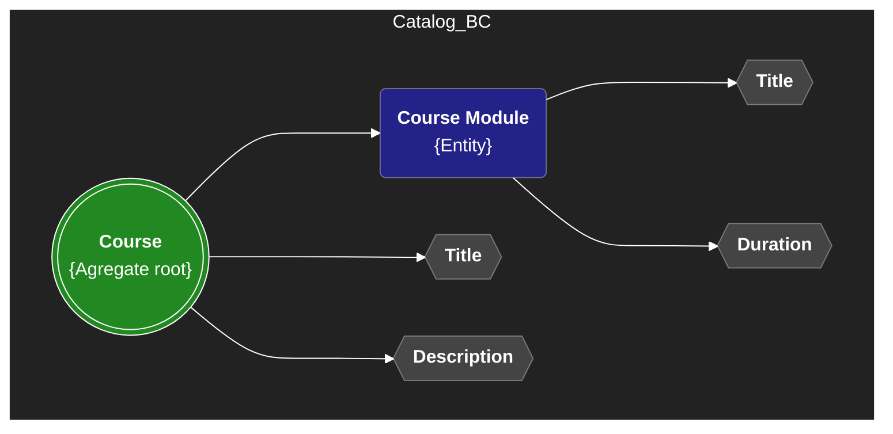
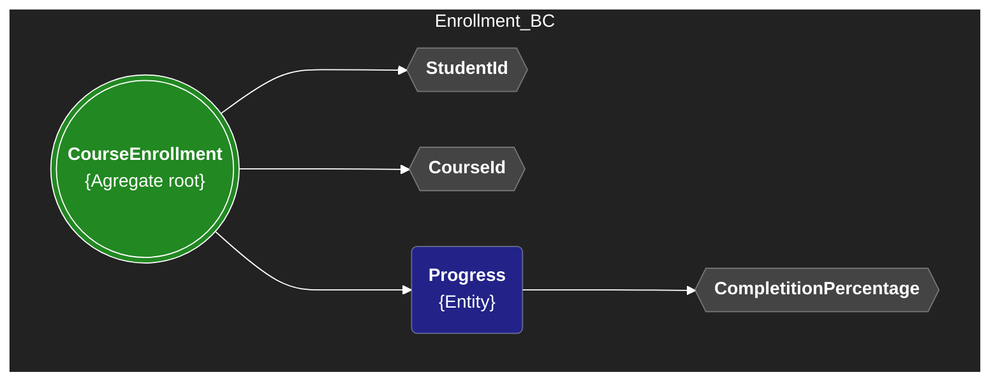
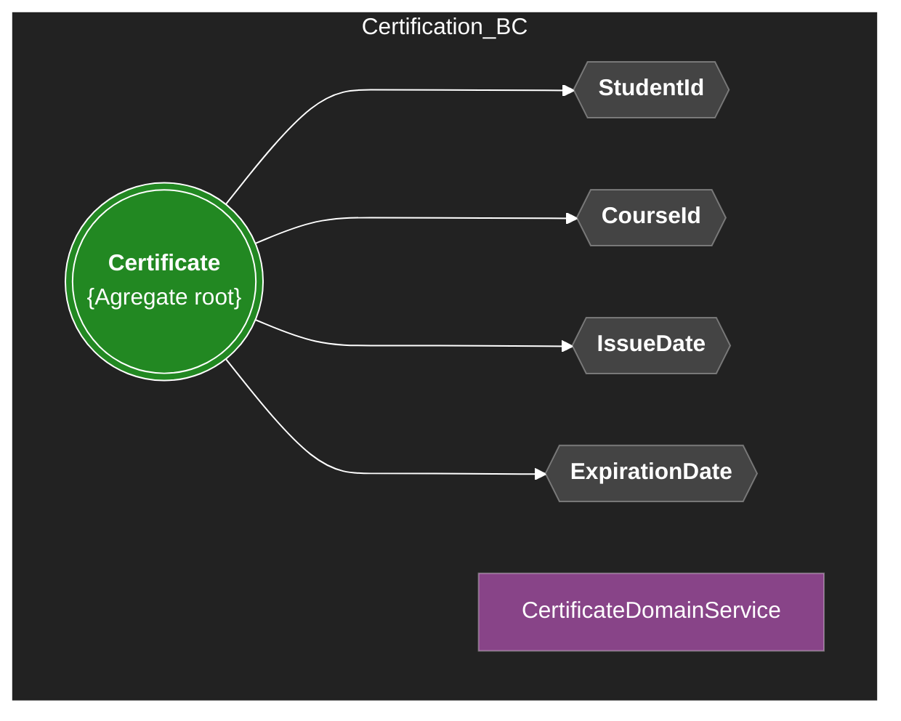
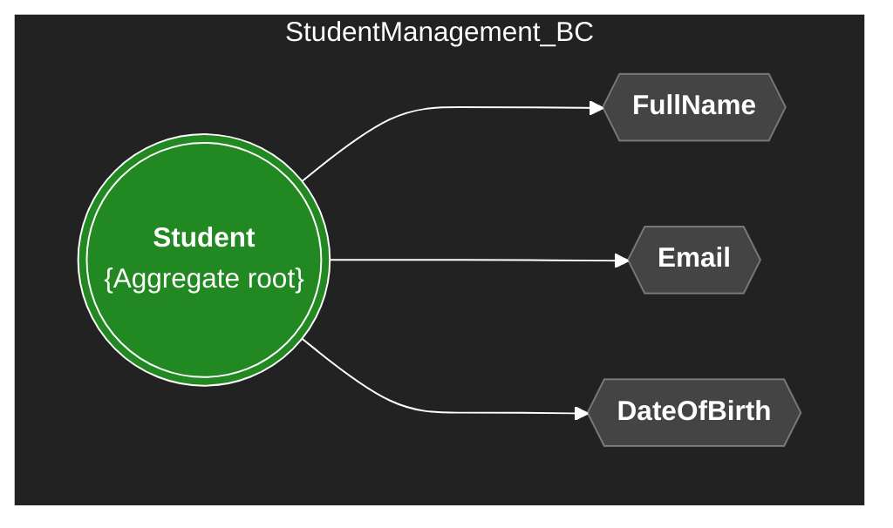

# Domain Layer Overview

This document describes the main bounded contexts, aggregate roots, value objects, domain events, and key business rules for the domain.

---

## Why Use Immutable Records for Value Objects?

In this project, all Value Objects are implemented as immutable C# records. This design choice brings several advantages for Domain-Driven Design:

- **Immutability:** Once created, a value object cannot be changed. This guarantees that its state remains consistent throughout its lifetime, preventing accidental or unintended modifications.
- **Value Equality:** Records in C# automatically implement value-based equality. Two value objects with the same data are considered equal, which is the expected behavior for value objects in DDD.
- **Thread Safety:** Immutable objects are inherently thread-safe, as their state cannot change after construction.
- **Conciseness:** Records reduce boilerplate code, as you do not need to manually override `Equals` and `GetHashCode`.
- **Expressiveness:** Immutability and value equality clearly communicate the intent and role of value objects in the domain model.

> **Note:** When using records with EF Core, always provide a parameterless constructor (public or protected) to ensure compatibility with the ORM.

---

## Bounded Contexts & Aggregate Roots

### Catalog BC

- **Aggregate Root:** `Course`
  - **Description:** Represents a course offered in the academy. Entry point for managing modules, title, and description.
  - **Entities:** `CourseModule`
  - **Value Objects:** `CourseTitle`, `CourseDescription`, `ModuleTitle`, `Duration`
  - **Domain Events:** `CourseCreated`, `CoursePublished`, `ModuleAddedToCourse`
  - **Validations:**
    - Course title and description must not be empty.
    - Modules must have a valid title and positive duration.
    - No duplicate modules per course.

### Enrollment BC

- **Aggregate Root:** `CourseEnrollment`
  - **Description:** Tracks a student's enrollment and progress in a course.
  - **Entities:** `Progress`
  - **Value Objects:** `StudentId`, `CourseId`, `CompletionPercentage`
  - **Domain Events:** `StudentEnrolled`, `LessonCompleted`, `CourseCompleted`
  - **Validations:**
    - A student can only be enrolled once per course.
    - Completion percentage must be between 0 and 100.
    - Progress must be updated only for enrolled students.

### Certification BC

- **Aggregate Root:** `Certificate`
  - **Description:** Represents a certificate issued to a student upon course completion.
  - **Value Objects:** `StudentId`, `CourseId`, `IssueDate`, `ExpirationDate`
  - **Domain Events:** `CertificateIssued`
  - **Domain Services:** `CertificateEligibilityService` (validates if a student is eligible for certification)
  - **Validations:**
    - Certificate can only be issued if the course is completed.
    - Expiration date must be after the issue date.
    - Each student can have only one certificate per course.

### Student Management BC

- **Aggregate Root:** `Student`
  - **Description:** Manages student information, lifecycle, and status. Entry point for personal data and enrollment eligibility.
  - **Value Objects:** `FullName`, `Email`, `DateOfBirth`
  - **Domain Events:** `StudentRegistered`, `StudentUpdated`, `StudentActivated`, `StudentSuspended`, `StudentDeleted`
  - **Validations:**
    - Email must be unique and valid.
    - Student must be in "Active" status to enroll in courses.
    - Cannot delete a student with active enrollments.

---

Each bounded context is independent and encapsulates its own rules, invariants, and business logic. Aggregate roots enforce consistency and invariants within their boundaries. Domain events are used to signal important state changes, and value objects ensure immutability and validation of key attributes. This approach promotes a clean, maintainable, and scalable domain model.
