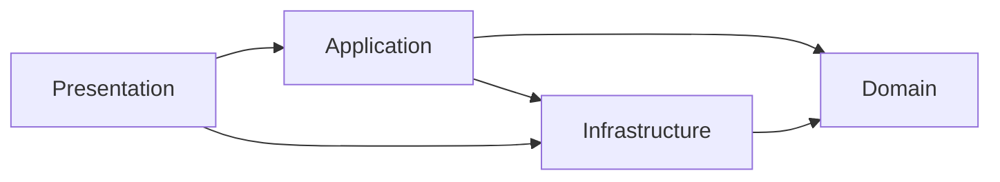
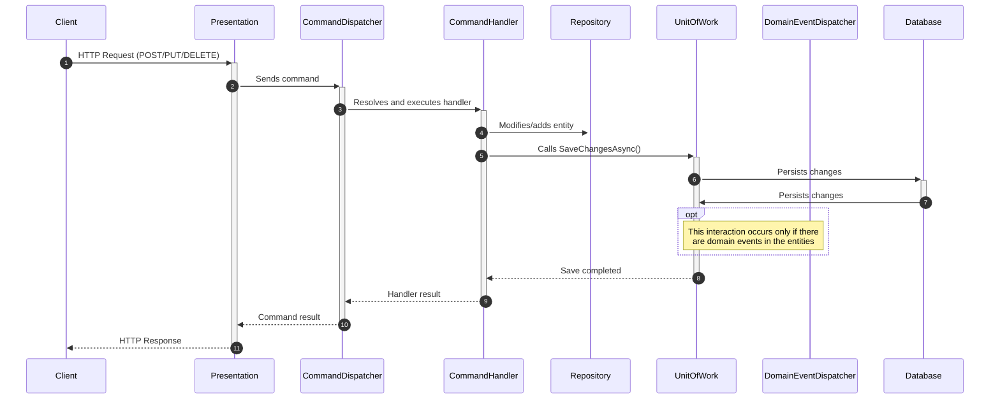
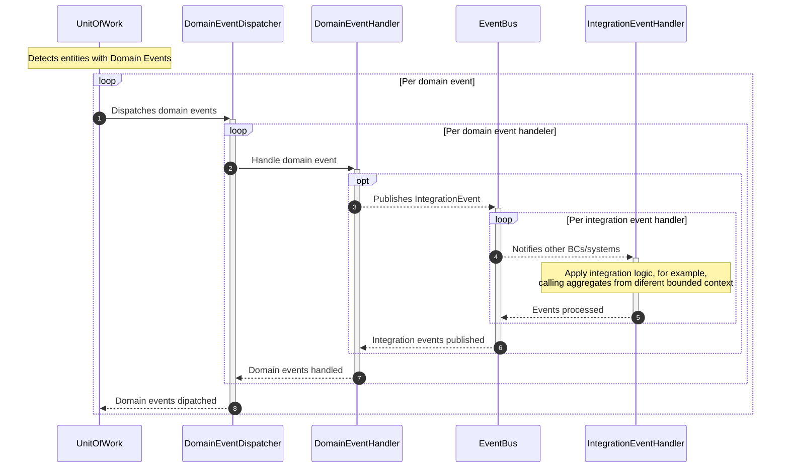
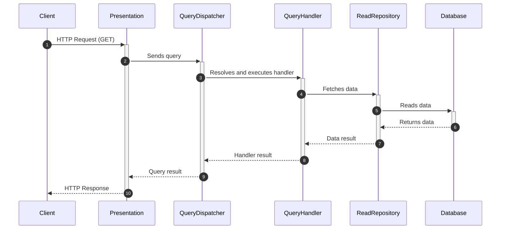

# AkataAcademy

AkataAcademy is an educational platform developed in .NET 8 following the principles of DDD (Domain-Driven Design), Clean Architecture, and CQRS. The goal is to provide a robust, scalable, and maintainable foundation for modern educational applications.

---

## Project Status 📊


### Bounded Contexts Progress

| BC                    | Progress                                                                                   | Status      | Details                                                            |
| --------------------- | ------------------------------------------------------------------------------------------ | ----------- | ------------------------------------------------------------------ |
| **Catalog**           |  | 🟢 Complete | Domain ✅ • Config ✅ • Migration ✅ • Handlers 🟡 • API ❌        |
| **StudentManagement** |  | 🟢 Complete | Domain ✅ • Config ✅ • Migration ✅ • Handlers 🟡 • API ❌        |
| **Enrollment**        |       | 🟡 Partial  | Domain ✅ • Config ✅ • Migration ✅ • Repository ✅ • Handlers 🟡 |
| **Certification**     |       | 🟡 Partial  | Domain ✅ • Config ✅ • Migration 🟡 • Handlers 🟡 • Issuance ❌   |

### Phase Roadmap

| Phase                                | Status                                                                                                | Progress | Deliverables                                                  |
| ------------------------------------ | ----------------------------------------------------------------------------------------------------- | -------- | ------------------------------------------------------------- |
| **Phase 1: Domain & Infrastructure** |     | 100%     | All domain models, EF Core config, migrations, 8 repositories |
| **Phase 2: Application & API**       |  | 50%      | Command/Query handlers, API endpoints, integration events     |
| **Phase 3: Integration & Features**  |     | 0%       | Cross-BC workflows, notifications, external integrations      |
| **Phase 4: Polish & Optimization**   |     | 0%       | Caching, performance, audit logging, Swagger documentation    |

### Feature Breakdown

**✅ Completed (11 items)**

-  All 4 BCs with entities, VOs, domain events
-  Fluent API, owned entities, converters, indexes
-  All migrations applied to PostgreSQL
-  Full coverage across all BCs
-  Read + Write models per BC
-  All services registered
-  Domain/readme.md + comprehensive patterns

**🟡 In Progress (4 items)**

-  Catalog done • Enrollment & Certification pending
-  Catalog working • Enrollment & Certification in progress
-  Domain events emitted • Cross-BC handlers pending
-  Read repos implemented • Specialized queries pending

**❌ Not Started (6 items)**

-  Workflow & API integration
-  Reports, insights, completion rates
-  Email, eligibility, milestones
-  Third-party validation, LMS adapters
-  Caching, optimization, batch operations
-  Change tracking, retention policies

---

## Table of Contents

- [AkataAcademy](#akataacademy)
  - [Project Status 📊](#project-status-)
    - [Bounded Contexts Progress](#bounded-contexts-progress)
    - [Phase Roadmap](#phase-roadmap)
    - [Feature Breakdown](#feature-breakdown)
  - [Table of Contents](#table-of-contents)
  - [Features](#features)
  - [Architecture](#architecture)
  - [Project Structure](#project-structure)
  - [Projects References](#projects-references)
  - [Technologies Used](#technologies-used)
  - [Installation and Running](#installation-and-running)
  - [Testing](#testing)
    - [Test Coverage by Domain](#test-coverage-by-domain)
    - [Running Tests](#running-tests)
    - [Switch to InMemory database for testing](#switch-to-inmemory-database-for-testing)
  - [API Usage](#api-usage)
    - [Catalog Endpoints](#catalog-endpoints)
    - [Enrollment Endpoints](#enrollment-endpoints)
    - [Certification \& Eligibility Endpoints](#certification--eligibility-endpoints)
  - [CQRS Workflow and Domain/Integration Events Sequence Diagrams](#cqrs-workflow-and-domainintegration-events-sequence-diagrams)
    - [1a. Command handling: Persistence](#1a-command-handling-persistence)
    - [1b. Command handling: Domain/Integration Events](#1b-command-handling-domainintegration-events)
    - [2. Query handeling](#2-query-handeling)
      - [Additional Notes](#additional-notes)
  - [Layers and Communication Diagram](#layers-and-communication-diagram)
  - [Conventions and Best Practices](#conventions-and-best-practices)
    - [Domain-Driven Design Patterns](#domain-driven-design-patterns)
    - [Enrollment \& Progression Patterns](#enrollment--progression-patterns)
    - [Certification Eligibility Patterns](#certification-eligibility-patterns)
  - [Contributions](#contributions)
  - [License](#license)

---

## Features

- **Flexible course progression strategies** (Standard 10%, Fast Track 5%, Slow Track 20%, Custom 1-100%)
- **Eligibility tracking and state management** with 6-month validity windows
- **Repository pattern** with 8 repositories (Course, Student, CourseEnrollment, Certificate + read models)
- **Domain-driven certification workflow** with event-driven architecture
- Dependency injection without [MediatR](https://github.com/jbogard/MediatR)
- Minimal API endpoints and traditional controllers
- HTTP tests included for main endpoints
- Flexible [EF Core](https://learn.microsoft.com/en-us/ef/core/) configuration (InMemory, SQL Server, PostgreSQL)
- **Comprehensive test coverage** (299 unit tests covering all bounded contexts)

## Architecture

The project follows Clean Architecture, with a clear separation of responsibilities into four main layers: Domain, Application, Infrastructure, and Presentation. For a detailed description of each layer and their responsibilities, see the [Project Structure](#project-structure) section below.

## Project Structure

```
AkataAcademy.sln
├── 📦 Application/
│   ├── 📄 AkataAcademy.Application.csproj
│   ├── 📁 Catalog/
│   │   ├── 📁 Commands/
│   │   ├── 📁 DTOs/
│   │   ├── 📁 Events/
│   │   └── 📁 Queries/
│   ├── 📁 Certification/
│   │   └── /.../
│   ├── 📁 StudentManagement/
│   │   └── /.../
│   ├── 📁 Enrollment/
│   │   └── /.../
│   └── 📁 Common/
│       ├── 📁 Dispatchers/
│       └── 📁 Integration/
├── 📦 Domain/
│   ├── 📄 AkataAcademy.Domain.csproj
│   ├── � readme.md (📖 [Domain Layer Overview](Domain/readme.md))
│   ├── �📁 BoundedContexts/
│   │   ├── 📁 Catalog/
│   │   ├── 📁 Certification/
│   │   ├── 📁 Enrollment/
│   │   └── 📁 StudentManagement/
│   └── 📁 Common/
├── 📦 Infrastructure/
│   ├── 📄 AkataAcademy.Infrastructure.csproj
│   ├── 📁 Messaging/
│   └── 📁 Persistence/
│       ├── 📁 Configurations/
│       └── 📁 Repositories/
├── 📦 Presentation/
│   ├── 📄 AkataAcademy.Presentation.csproj
│   ├── 📁 Controllers/
│   ├── 📝 appsettings.json
│   └── 📝 WebAPI.http
└── 📦 Tests/
    ├── 📄 AkataAcademy.UnitTests.csproj
    └── 📁 UnitTests/
        ├── 📁 Domain/
        │   ├── 📁 Catalog/
        │   ├── 📁 Certification/
        │   ├── 📁 Enrollment/
        │   └── 📁 StudentManagement/
        └── 📁 Common/
```

## Projects References



**Layered Overview:**

- **Application:** Use cases, commands, queries, DTOs, and handler registration.
- **Domain:** Core business logic, entities, value objects, and domain events, organized by bounded context. [🔎 Domain Layer Overview](Domain/readme.md)
- **Infrastructure:** Persistence (EF Core), messaging, repository implementations, and configurations.
- **Presentation:** API controllers, minimal API endpoints, configuration files, and HTTP test scripts.

## Technologies Used

- .NET 8
- Entity Framework Core 8.x
- PostgreSQL (production) / InMemory Database Provider (development/test)
- Npgsql (PostgreSQL provider for EF Core)
- CQRS (Command Query Responsibility Segregation)
- DDD (Domain-Driven Design)
- Minimal API
- Value Objects with Factory Pattern (`From` method)
- Dependency Injection

## Installation and Running

1. **Clone the repository:**
   ```bash
   git clone https://github.com/litoralcreativo/AkataAcademy.git
   cd AkataAcademy
   ```
2. **Restore NuGet packages:**
   ```bash
   dotnet restore
   ```
3. **Build the solution:**
   ```bash
   dotnet build
   ```
4. **Set up the database connection string (development):**
   - The connection string can be defined in `appsettings.json` under `ConnectionStrings:DefaultConnection`, but **we strongly recommend NOT storing sensitive credentials in this file** if your repository is public or shared.
   - Instead, use `dotnet user-secrets` to store the connection string securely for local development.
   - Navigate to the Presentation project folder:
     ```bash
     cd Presentation
     ```
   - If you want to use the InMemory database for testing, see the section [Switch to InMemory database for testing](#switch-to-inmemory-database-for-testing) further down in this README.
   - Initialize user-secrets:
     ```bash
     dotnet user-secrets init
     ```
   - Set the connection string (PostgreSQL example):
     ```bash
     dotnet user-secrets set "ConnectionStrings:DefaultConnection" "Host=localhost;Port=5432;Database=AkataAcademyDb;Username=your_username;Password=your_password"
     ```
   - **Tip:** To list all user-secrets:
     ```bash
     dotnet user-secrets list
     ```
   - **Tip:** To remove a user-secret:
     ```bash
     dotnet user-secrets remove "ConnectionStrings:DefaultConnection"
     ```
   - The connection string will be stored securely and not exposed in the repository.
     4.1. **Create and apply migrations (EF Core):**
   - To generate the initial migration (after setting the connection string):
     ```bash
     dotnet ef migrations add InitialCreate --project Infrastructure --startup-project Presentation
     ```
   - To apply the migration and create the tables in the database:
     ```bash
     dotnet ef database update --project Infrastructure --startup-project Presentation
     ```
   - **Tip:** If you change your model, create a new migration:
     ```bash
     dotnet ef migrations add <MigrationName> --project Infrastructure --startup-project Presentation
     dotnet ef database update --project Infrastructure --startup-project Presentation
     ```
   - **Troubleshooting:**
     - If you dropped the database or want to reset migrations:
       1. Delete the `Migrations` folder in `Infrastructure/Persistence`.
       2. Drop the `__EFMigrationsHistory` table from the database (using pgAdmin or SQL).
       3. Create a new migration and update the database as above.
   - For more info, see [EF Core migrations documentation](https://learn.microsoft.com/en-us/ef/core/managing-schemas/migrations/).
5. **Run the API:**
   ```bash
   dotnet run --project Presentation/AkataAcademy.Presentation.csproj
   ```
6. **Test the endpoints:**
   Use the `WebAPI.http` file to test the main endpoints from VS Code or tools like Postman.

## Testing

The project includes comprehensive unit test coverage with **299 tests** across all bounded contexts using xUnit.

### Test Coverage by Domain

- **Catalog BC Tests** - Course creation, module management, domain events (60+ tests)
- **StudentManagement BC Tests** - Student registration, status transitions, validation (70+ tests)
- **Enrollment BC Tests** (41 tests) - ProgressIncrement strategies, state transitions, progress tracking
- **Certification BC Tests** (35 tests) - Eligibility states, state transitions, expiration logic, audit trails

### Running Tests

```bash
# Run all tests
dotnet test

# Run tests with verbose output
dotnet test --verbosity detailed

# Run tests for a specific project
dotnet test Tests/UnitTests/AkataAcademy.UnitTests.csproj
```

### Switch to InMemory database for testing

- In `Infrastructure/DependencyInjection.cs`, comment out the Npgsql configuration line and uncomment the InMemory line:

  ```csharp
  // Comment this block
  services.AddDbContext<ApplicationDbContext>(
              options => options
                  .UseNpgsql(configuration.GetConnectionString("DefaultConnection")));

  // Uncomment this block
  // services.AddDbContext<ApplicationDbContext>(
  //     options => options
  //         .UseInMemoryDatabase("AkataAcademyDb"));
  ```

  - This allows you to run the application without PostgreSQL, ideal for quick tests or local development.
  - Remember to switch back to the Npgsql configuration for production or PostgreSQL integration.

## API Usage

### Catalog Endpoints

- **GET /api/catalog?includeUnpublished=true|false**: Gets published courses or all courses depending on the flag.
- **POST /api/catalog**: Creates a new course. Example payload:
  ```json
  {
    "title": "Understanding Software Architecture",
    "description": "POC of Domain-Driven Design, CQRS, and Clean Architecture"
  }
  ```

### Enrollment Endpoints

- **POST /api/enrollments**: Enroll a student in a course with a progression strategy. Example payload:
  ```json
  {
    "studentId": "uuid",
    "courseId": "uuid",
    "progressIncrement": 10
  }
  ```
- **PUT /api/enrollments/{enrollmentId}/progress**: Update enrollment progress
- **GET /api/enrollments/{studentId}**: Get all enrollments for a student
- **GET /api/enrollments/student/{studentId}/course/{courseId}**: Get specific enrollment

### Certification & Eligibility Endpoints

- **GET /api/eligibility/{studentId}/{courseId}**: Check eligibility status (PENDING, ELIGIBLE, INELIGIBLE, REVOKED)
- **POST /api/eligibility/{eligibilityRecordId}/mark-eligible**: Mark student as eligible for certification
- **POST /api/eligibility/{eligibilityRecordId}/revoke**: Revoke eligibility with reason
- **GET /api/certificates/{studentId}**: Get all certificates for a student
- **POST /api/certificates**: Issue a new certificate (requires ELIGIBLE status)

## CQRS Workflow and Domain/Integration Events Sequence Diagrams

### 1a. Command handling: Persistence



### 1b. Command handling: Domain/Integration Events



### 2. Query handeling



#### Additional Notes

- **EventBus** can be in-memory, RabbitMQ, Azure Service Bus, etc.
- **IntegrationEventHandler** can be in other bounded contexts or microservices.
- The flow is fully asynchronous and decoupled.
- You can have multiple IntegrationEventHandlers for the same event, each in a different context.

## Layers and Communication Diagram


## Conventions and Best Practices

- Value Objects use the Factory Pattern with a static `From` method for validation (e.g., `Email.From("user@mail.com")`).
- Value Objects with a single property are mapped using `HasConversion` in EF Core.
- Complex Value Objects (multiple properties) are mapped using `OwnsOne` in EF Core.
- All `DateTime` values are stored in UTC format for PostgreSQL compatibility.
- Command and query handlers are registered automatically by reflection.
- MediatR is not used; handlers are resolved via DI.
- It is recommended to maintain layer separation and avoid circular dependencies.

### Domain-Driven Design Patterns

- **Bounded Contexts:** Four independent contexts (Catalog, StudentManagement, Enrollment, Certification) with strict boundary enforcement
- **Aggregate Roots:** CourseEnrollment, EligibilityRecord, Certificate, Course, Student with defined invariants
- **Value Objects:** Immutable records with value-based equality and factory methods for validation
- **Domain Events:** State changes communicated across aggregates (StudentEnrolled → StudentBecameEligible)
- **State Machines:** Eligibility Record with states (PENDING → ELIGIBLE/INELIGIBLE → REVOKED)
- **Repository Pattern:** Write and read repositories per bounded context for persistence and querying

### Enrollment & Progression Patterns

- **Configurable Progress Strategies:** Support for Standard (10%), Fast Track (5%), Slow Track (20%), and Custom (1-100%) progression
- **State Transitions:** CourseEnrollment follows strict lifecycle: ENROLLED → ACTIVE → COMPLETED (or SUSPENDED/DROPPED)
- **Audit Trails:** Timestamps for all state changes (EnrolledOn, ActivatedOn, CompletedOn, SuspendedOn, DroppedOn)

### Certification Eligibility Patterns

- **Eligibility Record Lifecycle:** Independent aggregate tracking student eligibility separately from certificate issuance
- **State-Based Validation:** Four states with strict transition rules and event emission
- **Reason Tracking:** Ineligibility and revocation require documented reasons for compliance
- **Time Window Management:** 6-month validity window with automated expiration detection

For detailed information about Bounded Contexts, Aggregate Roots, Value Objects, and Domain Events, see [📖 Domain Layer Overview](Domain/readme.md).

## Contributions

Contributions are welcome! Please open an issue or pull request following the project's best practices.

## License

This project is under the MIT license. See the LICENSE.txt file for more details.
