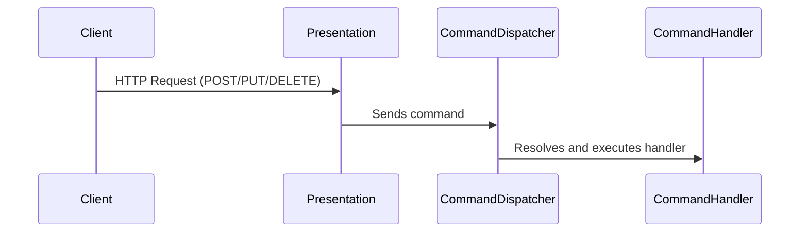
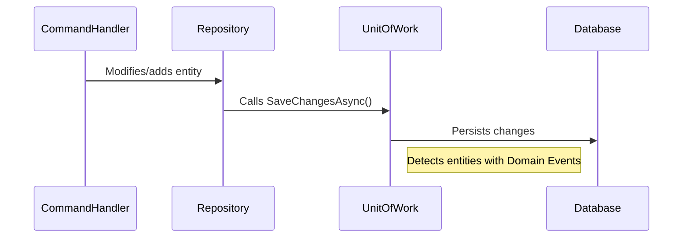
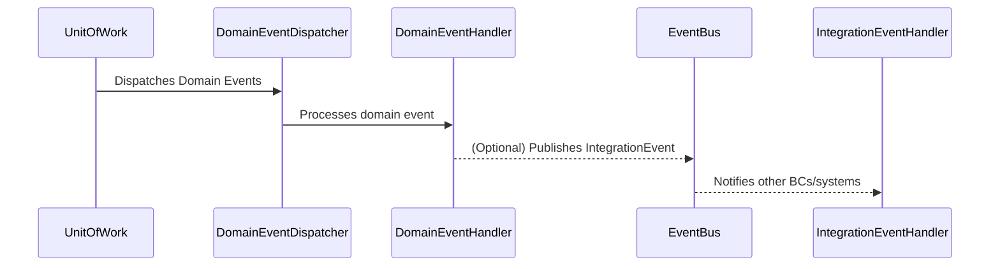

# AkataAcademy

AkataAcademy is an educational platform developed in .NET 8 following the principles of DDD (Domain-Driven Design), Clean Architecture, and CQRS. The goal is to provide a robust, scalable, and maintainable foundation for modern educational applications.

## Table of Contents

- [AkataAcademy](#akataacademy)
  - [Table of Contents](#table-of-contents)
  - [Features](#features)
  - [Architecture](#architecture)
  - [Project Structure](#project-structure)
  - [Technologies Used](#technologies-used)
  - [Installation and Running](#installation-and-running)
  - [Testing](#testing)
  - [API Usage](#api-usage)
  - [CQRS + Domain Events Sequence Diagram (by stages)](#cqrs--domain-events-sequence-diagram-by-stages)
    - [1. Input and Dispatch](#1-input-and-dispatch)
    - [2. Persistence and UnitOfWork](#2-persistence-and-unitofwork)
    - [3. Domain Events and EventBus](#3-domain-events-and-eventbus)
      - [Additional Notes](#additional-notes)
  - [Layers and Communication Diagram](#layers-and-communication-diagram)
  - [Conventions and Best Practices](#conventions-and-best-practices)
  - [Contributions](#contributions)
  - [License](#license)

---

## Features

- Clean and decoupled architecture ([DDD](https://martinfowler.com/bliki/DomainDrivenDesign.html) + [CQRS](https://martinfowler.com/bliki/CQRS.html) + [Clean Architecture](https://8thlight.com/blog/uncle-bob/2012/08/13/the-clean-architecture.html))
- Clear separation of layers: Domain, Application, Infrastructure, and Presentation
- Use of [Value Objects](https://martinfowler.com/bliki/ValueObject.html) and [Entities](https://martinfowler.com/bliki/EvansClassification.html)
- Dependency injection without [MediatR](https://github.com/jbogard/MediatR)
- Minimal API endpoints and traditional controllers
- HTTP tests included for main endpoints
- Flexible [EF Core](https://learn.microsoft.com/en-us/ef/core/) configuration (InMemory, SQL Server, PostgreSQL)

## Architecture

The project follows Clean Architecture, with a clear separation of responsibilities into four main layers: Domain, Application, Infrastructure, and Presentation. For a detailed description of each layer and their responsibilities, see the [Project Structure](#project-structure) section below.

## Project Structure

```
AkataAcademy.sln
├── Application/
│   ├── AkataAcademy.Application.csproj
│   ├── Catalog/
│   │   ├── Commands/
│   │   ├── DTOs/
│   │   ├── Queries/
│   └── Common/
├── Domain/
│   ├── AkataAcademy.Domain.csproj
│   ├── BoundedContexts/
│   │   ├── Catalog/
│   │   ├── Certification/
│   │   └── Enrollment/
│   └── Common/
├── Infrastructure/
│   ├── AkataAcademy.Infrastructure.csproj
│   ├── Messaging/
│   └── Persistence/
│       ├── Configurations/
│       └── Repositories/
└── Presentation/
    ├── AkataAcademy.Presentation.csproj
    ├── Controllers/
    ├── appsettings.json
    └── WebAPI.http
```

**Layered Overview:**

- **Application:** Use cases, commands, queries, DTOs, and handler registration.
- **Domain:** Core business logic, entities, value objects, and domain events, organized by bounded context.
- **Infrastructure:** Persistence (EF Core), messaging, repository implementations, and configurations.
- **Presentation:** API controllers, minimal API endpoints, configuration files, and HTTP test scripts.

## Technologies Used

- .NET 8
- Entity Framework Core 8.x
- InMemory Database Provider (development/test)
- CQRS (Command Query Responsibility Segregation)
- DDD (Domain-Driven Design)
- Minimal API
- Value Objects
- Dependency Injection

## Installation and Running

1. **Clone the repository:**
   ```bash
   git clone https://github.com/litoralcreativo/AkataAcademy.git
   cd AkataAcademy
   ```
2. **Restore NuGet packages:**
   ```bash
   dotnet restore
   ```
3. **Build the solution:**
   ```bash
   dotnet build
   ```
4. **Run the API:**
   ```bash
   dotnet run --project Presentation/AkataAcademy.Presentation.csproj
   ```
5. **Test the endpoints:**
   Use the `WebAPI.http` file to test the main endpoints from VS Code or tools like Postman.

## Testing

- The `WebAPI.http` file contains examples of GET and POST requests to test the API.
- You can add unit tests in the future using xUnit, NUnit, or MSTest.

## API Usage

- **GET /api/catalog?includeUnpublished=true|false**: Gets published courses or all courses depending on the flag.
- **POST /api/catalog**: Creates a new course. Example payload:
  ```json
  {
    "title": "Understanding Software Architecture",
    "description": "POC of Domain-Driven Design, CQRS, and Clean Architecture"
  }
  ```

## CQRS + Domain Events Sequence Diagram (by stages)

### 1. Input and Dispatch



### 2. Persistence and UnitOfWork



### 3. Domain Events and EventBus



#### Additional Notes

- **EventBus** can be in-memory, RabbitMQ, Azure Service Bus, etc.
- **IntegrationEventHandler** can be in other bounded contexts or microservices.
- The flow is fully asynchronous and decoupled.
- You can have multiple IntegrationEventHandlers for the same event, each in a different context.

## Layers and Communication Diagram


## Conventions and Best Practices

- Value Objects are mapped using `OwnsOne` in EF Core.
- Command and query handlers are registered automatically by reflection.
- MediatR is not used; handlers are resolved via DI.
- It is recommended to maintain layer separation and avoid circular dependencies.

## Contributions

Contributions are welcome! Please open an issue or pull request following the project's best practices.

## License

This project is under the MIT license. See the LICENSE.txt file for more details.
